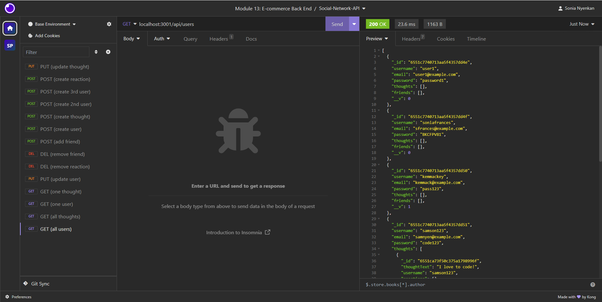

# Module 18 Challenge - NoSQL Challenge: Social Network API
<!-- On-the-job ticket or feature request Challenges -->

## Description 
This project is a social network API designed for a social media startup. The API utilizes a NoSQL database, specifically MongoDB, to efficiently handle large amounts of unstructured data. The application provides endpoints for managing users, thoughts, reactions to thoughts, and user friendships.

## User Story
AS A social media startup
I WANT an API for my social network that uses a NoSQL database
SO THAT my website can handle large amounts of unstructured data

## Acceptance Criteria
GIVEN a social network API
WHEN I enter the command to invoke the application
THEN my server is started and the Mongoose models are synced to the MongoDB database
WHEN I open API GET routes in Insomnia for users and thoughts
THEN the data for each of these routes is displayed in a formatted JSON
WHEN I test API POST, PUT, and DELETE routes in Insomnia
THEN I am able to successfully create, update, and delete users and thoughts in my database
WHEN I test API POST and DELETE routes in Insomnia
THEN I am able to successfully create and delete reactions to thoughts and add and remove friends to a user’s friend list

## Usage 
Clone the repository to your local machine.
Run npm install to install the necessary dependencies.
Ensure that MongoDB is installed on your machine.
Start the application by running npm start.
Open Insomnia or your preferred API testing tool to interact with the provided routes.
Use the various endpoints to perform CRUD operations on users, thoughts, reactions, and friendships.

 ## Screenshots
 

## Video Demo Links
Links:
https://drive.google.com/file/d/1wrmexqmjX8UPe218r2uRDsCk1rluEkcO/view
https://drive.google.com/file/d/10gbnKfb61C9gIMkk99KbiMDHhzSMgyRf/view
